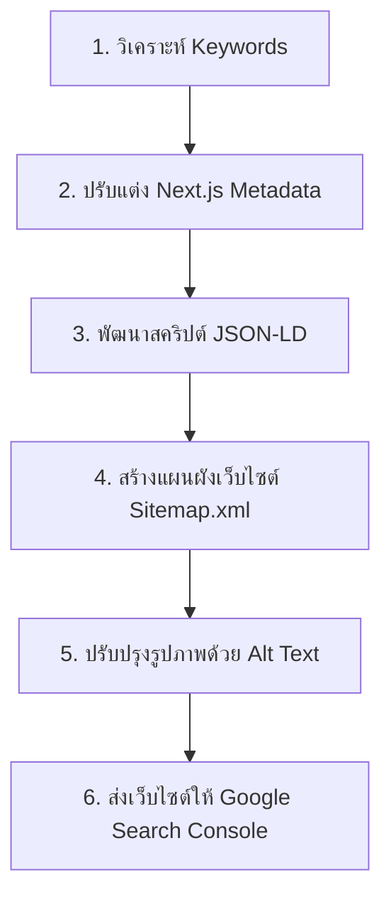

# 🚀 แผนการทำ SEO (Search Engine Optimization)
## สำหรับเว็บไซต์ V.N.S Engineering Hydraulic Co., Ltd.

เอกสารนี้คือแผนงานปรับแต่งและพัฒนาระบบหลังบ้านของเว็บไซต์เพื่อเป้าหมายในการทำ **SEO แบบธรรมชาติ (Organic SEO)** ให้มีประสิทธิภาพสูงสุด เมื่อลูกค้าค้นหาคำสำคัญ (Keywords) ที่เกี่ยวข้องกับสินค้าบน Google แล้วเจอเว็บไซต์ของเราในหน้าแรก **โดยไม่มีค่าโฆษณาใด ๆ**

---

## 📋 สรุปขั้นตอนการดำเนินงาน (Overview Checklist)



---

## 🛠️ แผนการดำเนินงานอย่างละเอียด (Detailed Action Plan)

### ขั้นที่ 1: การกำหนดกลุ่มคำค้นหาหลัก (Keywords Mapping)
เราจะจัดกลุ่มคำสำคัญที่ลูกค้าในอุตสาหกรรมมักใช้ค้นหาจริงบนอินเทอร์เน็ต และนำไปจับคู่กับหน้าสินค้าหลักของเรา:

| หน้าเพจสินค้า (Page Route) | กลุ่มคำค้นหาเป้าหมาย (SEO Keywords) |
| :--- | :--- |
| **Hydraulic Hose** | สายไฮดรอลิคแรงดันสูง, ประกอบสายไฮดรอลิคใกล้ฉัน, สายไฮดรอลิค 1/2, 4SP, 4SH, DIN EN 853 |
| **Stainless 304 (หัวสายสแตนเลส)** | หัวสายสแตนเลส 304, หัวสายสแตนเลส 316, ข้อต่อสแตนเลสอุตสาหกรรม, SUS304 |
| **Metal Hose (สายถักสแตนเลส)** | สายถักสแตนเลส, สายลูกฟูกสแตนเลส, Flexible Hose SUS304, สายทนความร้อนสูง |
| **PTFE / Teflon Hose** | สายเทฟลอน, สาย PTFE, สายทนเคมี, สายเทฟลอนถักสแตนเลส, สายทนความร้อน |
| **Industrial Pipe Service** | บริการดัดแป๊ปเหล็ก, ดัดท่อไฮดรอลิค, ดัดแป๊ปอุตสาหกรรม, ตัดดัดแป๊ปตามสั่ง |

---

### ขั้นที่ 2: ปรับปรุงโค้ด Metadata ของ Next.js ทุกหน้า
เราจะปรับปรุงค่า `<head>` ของแต่ละหน้าสินค้าเพื่อบอก Search Engine บอทโดยตรงว่าหน้านี้มีเนื้อหาเกี่ยวกับอะไร

#### 📝 ตัวอย่างโครงสร้างการปรับปรุง Metadata ในหน้า `app/products/hydraulic-hose/page.tsx`:
```typescript
export const metadata = {
  title: "สายไฮดรอลิคแรงดันสูง (Hydraulic Hose) มาตรฐาน DIN | V.N.S Engineering",
  description: "ศูนย์รวมสายไฮดรอลิค 1SN, 2SN, 4SP, 4SH มาตรฐานระดับสากล ทนแรงดันสูง บริการประกอบหัวสายตามความต้องการ พร้อมส่งทั่วประเทศ",
  keywords: [
    "HYDRAULIC HOSE",
    "สายไฮดรอลิคแรงดันสูง",
    "สายไฮดรอลิค 1/2",
    "สายไฮดรอลิค 1/4",
    "ประกอบหัวสายไฮดรอลิค",
    "สายไฮดรอลิคใกล้ฉัน",
    "4SP DIN EN 856",
    "4SH DIN EN 856",
    "V.N.S Engineering"
  ],
  openGraph: {
    title: "สายไฮดรอลิคแรงดันสูง (Hydraulic Hose) - V.N.S Engineering",
    description: "รายละเอียดสเป็คและการใช้งานสายไฮดรอลิคสำหรับโรงงานและเครื่องจักรกล",
    images: ["/products/products/HYDRAULIC HOSE.png"],
  }
};
```

---

### ขั้นที่ 3: การฝังโครงสร้างข้อมูลสินค้า (JSON-LD Structured Data)
นี่คือโค้ดพิเศษที่ทำให้ Google เข้าใจประเภทสินค้าของเราอย่างลึกซึ้ง และช่วยเพิ่มประสิทธิภาพในการดึงหน้าเว็บไปแสดงผล

#### 💻 ตัวอย่างการฝัง JSON-LD ลงในคอมโพเนนต์หน้ารายละเอียดสินค้า:
```tsx
export default function HydraulicHosePage() {
  const jsonLd = {
    "@context": "https://schema.org",
    "@type": "Product",
    "name": "สายไฮดรอลิคแรงดันสูง (Hydraulic Hose) V.N.S",
    "image": "https://vns-engineering.com/products/products/HYDRAULIC HOSE.png",
    "description": "สายไฮดรอลิคคุณภาพสูงสำหรับอุตสาหกรรม มาตรฐาน DIN EN 853 และ DIN EN 856",
    "brand": {
      "@type": "Brand",
      "name": "V.N.S Engineering"
    },
    "offers": {
      "@type": "AggregateOffer",
      "priceCurrency": "THB",
      "lowPrice": "0", // หรือใส่ราคาเริ่มต้นหากต้องการ
      "priceValidUntil": "2027-12-31",
      "itemCondition": "https://schema.org/NewCondition",
      "availability": "https://schema.org/InStock"
    }
  };

  return (
    <>
      <script
        type="application/ld+json"
        dangerouslySetInnerHTML={{ __html: JSON.stringify(jsonLd) }}
      />
      {/* ... โค้ด HTML เดิมของคุณ ... */}
    </>
  );
}
```

---

### ขั้นที่ 4: การสร้างไฟล์ Sitemap อัตโนมัติ (`app/sitemap.ts`)
เราจะสร้างไฟล์แผนผังเว็บไซต์เพื่อให้ Google เข้ามารวบรวมลิงก์ทั้งหมดได้อย่างรวดเร็ว

#### 📄 โค้ดสำหรับไฟล์ `app/sitemap.ts`:
```typescript
import { MetadataRoute } from 'next';

export default function sitemap(): MetadataRoute.Sitemap {
  const baseUrl = 'https://vns-engineering.com'; // แก้ไขเป็น Domain จริงของคุณ

  const routes = [
    '',
    '/about',
    '/products/stainless-304',
    '/products/hydraulic-hose',
    '/products/stainless-steel-flexible-hose',
    '/products/ptfe-teflon-hose',
    '/products/r7-thermoplastic-hose',
    '/products/steam-hose',
    '/products/toyox',
    '/products/industrial-hose',
    '/products/tube-fittings',
    '/products/camlock-coupling',
    '/products/quick-coupling',
    '/products/hydraulic-ball-valve',
    '/products/industrial-pipe-service'
  ];

  return routes.map((route) => ({
    url: `${baseUrl}${route}`,
    lastModified: new Date().toISOString(),
    changeFrequency: 'weekly',
    priority: route === '' ? 1.0 : 0.8,
  }));
}
```

---

### ขั้นที่ 5: การเพิ่มประสิทธิภาพคำอธิบายรูปภาพ (Image Alt Text)
Google บอทมองไม่เห็นรูปภาพอิมเมจโดยตรง แต่จะอ่านค่า `alt` ของรูปภาพ เราจะค้นหาภาพสินค้าสำคัญและปรับแต่งให้มี Keyword ที่เป็นประโยชน์

* **หน้าประกอบสาย**: เปลี่ยนจาก `alt="hose assembly"` ➡️ `alt="บริการประกอบหัวสายไฮดรอลิคอุตสาหกรรม V.N.S Engineering"`
* **หน้าสายถัก**: เปลี่ยนจาก `alt="metal hose"` ➡️ `alt="สายถักสแตนเลส SUS304 พร้อมหัวสายสแตนเลสทนความร้อนสูง"`

---

### ขั้นที่ 6: การยื่นและเปิดใช้งานบน Google Search Console (ฟรี!)
หลังจากเขียนโค้ดและเผยแพร่เว็บไซต์ (Deploy) ขึ้นอินเทอร์เน็ตจริงแล้ว มีขั้นตอนส่งเว็บไซต์ให้ Google ดังนี้ครับ:
1. เข้าไปที่ [Google Search Console](https://search.google.com/search-console/)
2. ยืนยันสิทธิ์ความเป็นเจ้าของเว็บไซต์ (เช่น ผ่านทาง DNS TXT Record หรือ HTML File Upload)
3. ไปที่เมนู **Sitemaps** แล้วกดส่งลิงก์ `https://yourdomain.com/sitemap.xml`
4. Google จะเริ่มเข้ามาเก็บข้อมูล (Index) หน้าสินค้าทุกหน้าทันทีภายใน 24-72 ชั่วโมง!

---

> [!NOTE]
> แผนงานทั้งหมดนี้สามารถเขียนและติดตั้งลงบนโค้ดปัจจุบันของคุณได้ทันทีโดยไม่รบกวนดีไซน์หน้าเว็บเดิม และไม่มีค่าใช้จ่ายแอบแฝงใด ๆ ครับ

> [!TIP]
> การทำ SEO แบบออแกนิคจะใช้เวลาในการประมวลผลจัดอันดับบน Google ประมาณ 1-4 สัปดาห์ในการขึ้นมาแสดงผลเมื่อมีคนค้นหาคีย์เวิร์ดอย่างเป็นธรรมชาติ ยิ่งเราใส่ข้อมูลได้ละเอียด บอทยิ่งให้คะแนนสูงขึ้นครับ!

---

### 🚀 พร้อมที่จะเริ่มดำเนินการตามแผนนี้เลยไหมครับ?
หากตกลง ผมยินดีเริ่มทำงานใน **ขั้นตอนที่ 2 และ 3 (Metadata & JSON-LD)** และ **ขั้นตอนที่ 4 (Sitemap)** ให้ในโฟลเดอร์งานของคุณทันทีครับ! แจ้งผมได้เลยนะครับ 😊
